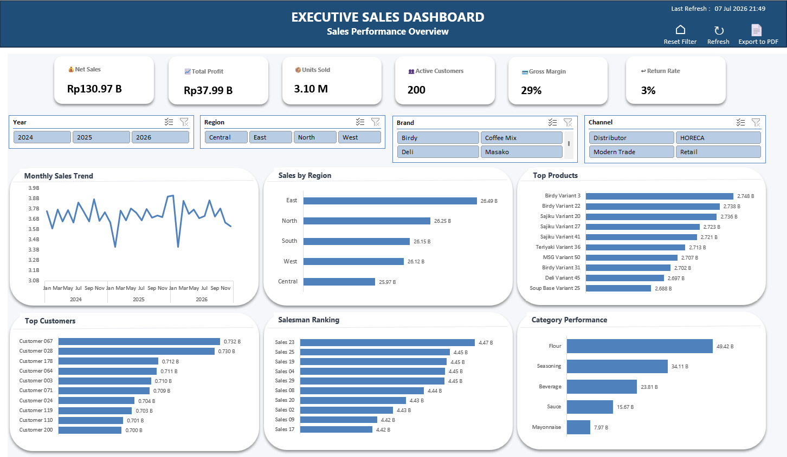

# 📊 Executive Sales Dashboard

Interactive Executive Sales Dashboard built using **Microsoft Excel**, **Data Model**, **PivotTable**, **PivotChart**, **Slicers**, and **VBA**.

---

## 📷 Dashboard Preview

> Ganti path jika nama file berbeda.



---

## 🚀 Project Overview

This project demonstrates how Microsoft Excel can be transformed into an interactive Business Intelligence dashboard for executive-level sales monitoring.

The dashboard enables users to analyze sales performance through dynamic KPIs, interactive charts, and slicers without requiring external BI tools.

---

## ✨ Features

- 📈 Executive KPI Cards
  - Net Sales
  - Total Profit
  - Units Sold
  - Active Customers
  - Gross Margin
  - Return Rate

- 📊 Interactive Visualizations
  - Monthly Sales Trend
  - Sales by Region
  - Top Products
  - Top Customers
  - Salesman Ranking
  - Category Performance

- 🎛 Interactive Slicers
  - Year
  - Region
  - Brand
  - Channel

- ⚡ VBA Automation
  - Refresh Dashboard
  - Reset Filters
  - Export Dashboard to PDF

---

## 🛠 Technologies Used

- Microsoft Excel
- Excel Data Model
- PivotTable
- PivotChart
- Power Query (optional)
- VBA (Visual Basic for Applications)

---

## 📂 Data Model

The dashboard follows a simple Star Schema.

```
                Dim_Date
                    │
                    │
Dim_Product ─ Fact_Sales ─ Dim_Customer
                    │
                    │
             Dim_Salesman
```

---

## 📋 Dashboard Components

| Component | Description |
|-----------|-------------|
| KPI Cards | Executive summary metrics |
| Monthly Trend | Monthly Net Sales Trend |
| Sales by Region | Revenue comparison by region |
| Top Products | Top 10 products by Net Sales |
| Top Customers | Top 10 customers by Net Sales |
| Salesman Ranking | Top performing salesmen |
| Category Performance | Sales contribution by product category |

---

## 📁 Repository Structure

```
Executive-Sales-Dashboard
│
├── Executive_Sales_Dashboard_v3.xlsm
├── README.md
├── LICENSE
└── screenshots
    └── dashboard.png
```

---

## ▶ How to Use

1. Download the Excel workbook.
2. Enable Macros.
3. Open the **Dashboard** sheet.
4. Use slicers to filter the data.
5. Click **Refresh** to update PivotTables.
6. Click **Export PDF** to generate a report.

---

## 🎯 Skills Demonstrated

- Data Modeling
- Star Schema Design
- Dashboard Design
- Excel Data Model
- PivotTable
- PivotChart
- Interactive Slicers
- KPI Development
- Business Intelligence
- VBA Automation

---

## 👨‍💻 Author

**Dimaz Permana**

IT Data Analytics / IT Development Operations

GitHub:
https://github.com/diemazt84

---

## 📄 License

This project is licensed under the MIT License.
